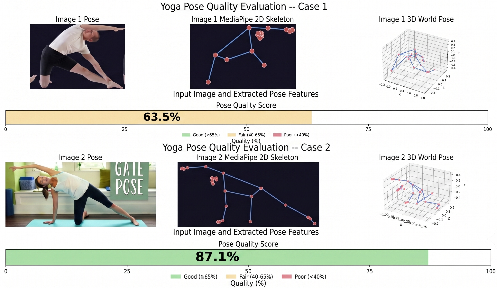

# Yoga Pose Quality Scorer

A machine-learning system that learns to score yoga pose quality from **your own pairwise preferences**. You label pairs of poses as better or worse, train a [Bradley-Terry](https://en.wikipedia.org/wiki/Bradley%E2%80%93Terry_model) preference model, and get a scalar quality score (0–100%) for any new pose image. An optional Denoising Autoencoder (DAE) cleans up noisy or partially-occluded landmark estimates before scoring, improving robustness.


---

## How it works

### The core idea: learning from comparisons

Instead of defining "good posture" by hand, the system learns it from human comparisons. You are shown two photos of the same yoga pose and press a key to say which one looks better aligned. After enough comparisons, the model builds a consistent ranking of pose quality.

The mathematical backbone is the **Bradley-Terry model**: given two poses A and B, the probability that a human would prefer A is:

```
p(A wins) = σ(s_A − s_B)
```

where `s_A` and `s_B` are scalar quality scores produced by a small neural network, and `σ` is the sigmoid function. The network is trained so that the winner of each labeled pair consistently receives a higher score than the loser.

### The pipeline

```
Yoga images
    │
    ▼
[1] MediaPipe  ──►  33 body landmarks (3D world coordinates)
    │
    ▼
[2] Pose normalisation  ──►  view-invariant 132-dim feature vector
    │                         (centre, scale, SE(3) body-frame rotation,
    │                          reflection canonicalisation)
    ▼
[3a] DAE (optional)  ──►  denoised landmarks (removes jitter / occlusion artefacts)
    │
    ▼
[3b] Bradley-Terry MLP  ──►  scalar quality score  →  0–100%
```

### Why pose normalisation matters

MediaPipe reports landmarks in a coordinate frame that depends on the camera angle. Two photos of the *same* pose from different viewpoints would produce completely different raw coordinates. Normalisation removes this dependency:

1. **Y-flip** — MediaPipe's Y axis points down; we flip it to point up.
2. **Centering** — subtract the hip midpoint so every pose is centred at the origin.
3. **Scale** — divide by torso length (hip → shoulder distance) so body size does not matter.
4. **SE(3) body-frame rotation** *(full variant)* — build a canonical coordinate frame from the anatomy itself (spine = +Y, right shoulder = +X, forward = +Z) using Gram-Schmidt orthonormalisation. This removes yaw, pitch, *and* roll — including the out-of-plane tilt the simpler XY-only rotation leaves unhandled.
5. **Reflection canonicalisation** — if the right shoulder ends up on −X after step 4 (camera mirroring, ambiguous orientation), flip the X axis so mirror-image captures of the same pose share the same representation.

### Why the Denoising Autoencoder?

MediaPipe sometimes produces noisy or jittery landmarks, especially for occluded joints (hands behind the back, ankles cut off by the frame). The DAE learns to reconstruct clean poses from corrupted inputs by training on the cached landmark dataset with added Gaussian noise and random joint masking. Passing landmarks through the DAE before scoring reduces these artefacts and improves ranking accuracy.

The DAE architecture uses ResBlocks with additive skips and a 15% input bypass connection, which prevents it from collapsing all predictions to the mean pose when joints are missing.

### What the MLP actually learns

The Bradley-Terry MLP is a 5-layer network: `132 → 256 → 128 → 64 → 1`. Each hidden layer uses LayerNorm + GELU + 0.1 Dropout. The single output is an unbounded scalar quality logit; applying sigmoid and multiplying by 100 gives the displayed percentage.

A clean, consistently-labelled dataset of ~4000–5000 pairs typically reaches **~76–78% validation accuracy** (percentage of held-out pairs where the model correctly ranks winner above loser). Human rater agreement on subjective pose quality is estimated at 80–85%, so this is close to human-level.

---

## Requirements

**Python 3.10+** is required.

```bash
pip install mediapipe opencv-python torch numpy tqdm matplotlib pillow
```

Full dependency list (for the 3D-vision experiments in this repo):

```bash
pip install -r requirements.txt
```

For orientation files proceed to create a different enviroment and use this dependencies (the mediapipe version require differs from the rest):

```bash
pip install -r yoga_pose_env.txt
```

---


## Dataset

All scripts expect the [Yoga Pose Image Classification Dataset](https://www.kaggle.com/datasets/shrutisaxena/yoga-pose-image-classification-dataset) from Kaggle. Download it with:

```bash
python download_data.py
```

The dataset is placed at:
```
~/.cache/kagglehub/datasets/shrutisaxena/yoga-pose-image-classification-dataset/versions/1/dataset/
```

107 pose classes, ~5994 images total. Each class is a subdirectory of JPEG images.

---

## Step 1 — Collect preference labels

```bash
python preference_labeler.py
```

The app shows **pairs of images from the same pose class**. Each pair displays:
- A filled, part-coloured body render (SMPL-style) at the top — lets you judge body alignment clearly even for complex or inverted poses
- The original 2D photo at the bottom

Press `←` to prefer the left pose, `→` to prefer the right. Labels are saved to `preferences.jsonl` automatically; you can quit and resume at any time without losing progress.

**Target:** ~5000 comparisons for a reliable model. Each session appends to the file.

### Label file format

Each line in `preferences.jsonl` is a JSON object:

```json
{"winner": "/path/to/image_A.jpg", "loser": "/path/to/image_B.jpg", "class": "warrior_i", "timestamp": "..."}
```

Multiple label files can be merged before training. If you changed the labelling criteria between sessions (e.g. after updating the visualiser), train on each file separately first to check consistency before merging.

---

## Step 2 — Train the Bradley-Terry model

Two variants are available, differing only in the normalisation applied to each pose.

### Standard (XY-plane rotation)

```bash
python train_bradley_terry.py
```

Normalises by centering, scaling, and rotating in the XY-plane to align the torso to +Y. Handles frontal and back-facing views well; less robust to sideways or tilted camera angles.

### SE(3) + reflection (full orientation normalisation)

```bash
python train_bradley_terry_orientation.py
```

Adds full 3-axis Gram-Schmidt body-frame alignment and reflection canonicalisation (see [How it works](#how-it-works-overview-for-newcomers) above). More invariant to camera angle; recommended when your dataset mixes viewpoints.

### What both scripts do

1. Run MediaPipe on every unique image and cache 3D world landmarks to `landmark_cache.pkl` (subsequent runs read from cache — much faster)
2. Normalise each pose into a 132-dim vector
3. Train a 132→256→128→64→1 MLP with Bradley-Terry loss
4. Save the best checkpoint (by validation accuracy) to `pose_scorer.pt`
5. Write epoch-by-epoch metrics to `training_history.json`

### Options

| Flag | Default | Description |
|---|---|---|
| `--prefs` | `preferences.jsonl` | Path to the labels file |
| `--epochs` | `60` | Number of training epochs |
| `--batch-size` | `64` | Batch size |
| `--lr` | `3e-4` | Initial learning rate |
| `--no-rotate` | off | Disable rotation normalisation entirely |

```bash
python train_bradley_terry_orientation.py --prefs my_labels.jsonl --epochs 80
```

---

## Step 3 — (Optional) Train the Denoising Autoencoder

The DAE is a separate model that learns to reconstruct clean pose landmarks from noisy or occluded inputs. It is not required for basic scoring, but it improves accuracy when MediaPipe detections are noisy.

```bash
python train_dae.py
```

The DAE is trained on the same `landmark_cache.pkl` produced in Step 2, so you must run the Bradley-Terry training script at least once first (it builds the cache).

### What it does

1. Loads every normalised pose from `landmark_cache.pkl`
2. At each training step, corrupts the input with Gaussian noise and random joint masking (simulating real-world occlusion)
3. Trains a 99→128→64→128→99 residual autoencoder to reconstruct the clean pose
4. Uses a weighted MSE loss that applies 3× extra weight to peripheral joints (wrists, hands, ankles, feet) — these collapse first under standard MSE and the weighting prevents them from being silently dropped
5. An additional bone-length consistency loss keeps anatomical proportions realistic

### Options

| Flag | Default | Description |
|---|---|---|
| `--noise` | `0.01` | Gaussian noise standard deviation |
| `--occ` | `0.0` | Joint occlusion probability (fraction of joints masked per sample) |
| `--latent` | `64` | Bottleneck latent dimension |
| `--epochs` | `150` | Number of training epochs |
| `--cache` | `landmark_cache.pkl` | Path to the landmark cache |
| `--out` | `dae.pt` | Output checkpoint path |

Best configuration found: `--noise 0.01 --occ 0.02` → `dae_noise001_occ002.pt`.

```bash
python train_dae.py --noise 0.01 --occ 0.02 --out dae_noise001_occ002.pt
```

---

## Step 4 — Score a pose image

```bash
python score_pose.py path/to/your/image.jpg
```

Produces a 4-panel figure saved to `score_result.png`:

| Panel | Content |
|---|---|
| Original image | The input photo |
| 2D skeleton | MediaPipe landmark overlay on a dark background |
| 3D world pose | 3D skeleton plot (matplotlib) |
| Score bar | Quality % with colour coding and raw logit |

Score colour bands:
- **Green** — Good (≥ 65%)
- **Yellow** — Fair (40–65%)
- **Red** — Poor (< 40%)

### Options

```bash
python score_pose.py image.jpg --checkpoint pose_scorer.pt   # specific checkpoint
python score_pose.py image.jpg --no-rotate                   # disable rotation normalisation
```

The checkpoint embeds the rotation setting used during training (`se3_rotate` key, with fallback to `rotate` for older checkpoints). `--no-rotate` only overrides if the checkpoint does not record a setting.

---

## Evaluation

### Does the DAE actually help?

```bash
python evaluate_dae.py
```

Compares Bradley-Terry ranking accuracy with and without DAE denoising on the full preference dataset. Outputs:
- Console table with overall and per-class accuracy
- `dae_evaluation_overall.png` — overall accuracy bar + pair breakdown
- `dae_evaluation_per_class.png` — per-class accuracy comparison (top 20 classes by pair count)

### Pipeline comparison

```bash
python evaluate_pipeline.py
```

Compares four pipeline modes:

| Mode | Description |
|---|---|
| Raw | `pose_scorer.pt` score only |
| DAE + Raw | DAE-denoised landmarks → `pose_scorer.pt` |
| Rerank | `α × quality_score + (1−α) × joint_completeness_score` |
| DAE + Rerank | DAE denoising + reranking |

The script sweeps `α ∈ {0.5, 0.6, 0.7, 0.8, 0.9, 1.0}` to find the best reranking weight automatically. Outputs `pipeline_comparison.png`.

### DAE configuration search

```bash
python compare_configs.py
```

Auto-discovers all `dae*.pt` files in the current directory and evaluates each against the Bradley-Terry scorer. Outputs a comparison table and `compare_configs.png`.

---

## File reference

### Scripts

| File | Description |
|---|---|
| `download_data.py` | Download the Kaggle yoga pose dataset |
| `preference_labeler.py` | Tkinter GUI for pairwise preference labelling |
| `train_bradley_terry.py` | Bradley-Terry training (XY-plane rotation normalisation) |
| `train_bradley_terry_orientation.py` | Bradley-Terry training (full SE(3) + reflection normalisation) |
| `train_dae.py` | Denoising Autoencoder training |
| `score_pose.py` | Single-image inference and 4-panel visualisation |
| `evaluate_dae.py` | Measure DAE impact on ranking accuracy |
| `evaluate_pipeline.py` | Compare raw / DAE / rerank / DAE+rerank pipeline modes |
| `compare_configs.py` | Benchmark multiple DAE checkpoints side by side |
| `plot_dae_training.py` | Plot DAE training curves from hardcoded log |
| `extract_3d_pose.py` | Batch MediaPipe extraction → `yoga_poses_3d.json` |
| `visualize_and_mainpulate.py` | Rotate, scale, translate and plot a 3D skeleton from JSON |
| `yoga_poses_3d.py` | Batch 3D landmark extraction to JSON |

### Data files

| File | Description |
|---|---|
| `preferences.jsonl` | Human pairwise preference labels |
| `preferences_merged.jsonl` | Merged labels (quality + visual criteria sessions) |
| `pose_quality.jsonl` | Per-image quality annotations |
| `missing_joints.jsonl` | Entries flagged for occluded/missing keypoints |
| `merge_all.jsonl` | Full merged dataset across all labelling sessions |
| `landmark_cache.pkl` | Cached MediaPipe 3D world landmarks (auto-generated) |
| `training_history.json` | Per-epoch train/val metrics from the last training run |

### Model checkpoints

| File | Description |
|---|---|
| `pose_scorer.pt` | Best Bradley-Terry MLP checkpoint |
| `preferences.pt` | Serialised preference score tensor |
| `missing_joints.pt` | Serialised joint-completeness score tensor |
| `dae_noise001_occ002.pt` | Best DAE checkpoint (noise=0.01, occlusion=0.02) |
| `dae_noise*.pt` | Ablation DAE checkpoints (various noise/occlusion configs) |

### Notebooks

| File | Description |
|---|---|
| `metrics.ipynb` | Metric exploration and result analysis |
| `code/code.ipynb` | Early voxelisation experiments (Phase 1) |

---

## Normalisation variants — quick reference

| | Standard (`train_bradley_terry.py`) | SE(3) (`train_bradley_terry_orientation.py`) |
|---|---|---|
| Y-flip | ✓ | ✓ |
| Hip centering | ✓ | ✓ |
| Torso scaling | ✓ | ✓ |
| Rotation | XY-plane only (yaw) | Full Gram-Schmidt (yaw + pitch + roll) |
| Reflection fix | ✗ | ✓ |
| Checkpoint key | `rotate` | `se3_rotate` (+ `rotate` for back-compat) |

Both produce a 132-dim vector and use the same MLP architecture. Choose the SE(3) variant if your dataset includes sideways or tilted camera angles.

---

## Checkpoint compatibility

Checkpoints save the normalisation mode they were trained with. `score_pose.py` reads `se3_rotate` first and falls back to `rotate`, so all existing checkpoints remain valid without re-training.

```python
# What the checkpoint contains
{
    'model_state': ...,
    'val_acc':     0.77,
    'epoch':       42,
    'rotate':      True,      # kept for backward compatibility
    'se3_rotate':  True,      # True = full Gram-Schmidt + reflection
    'hidden':      [256, 128, 64],
    'input_dim':   132,
}
```
